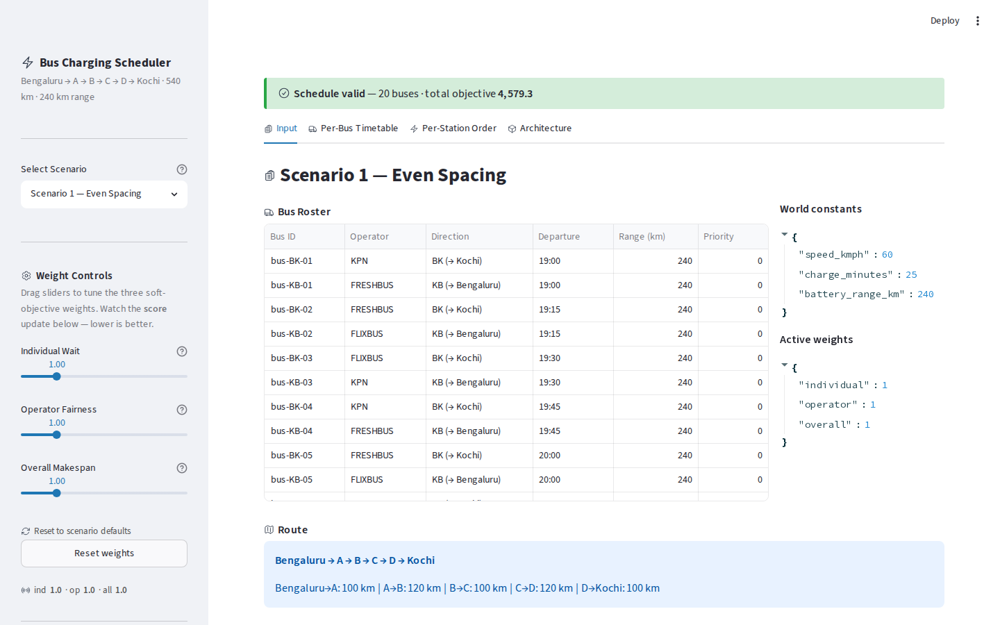
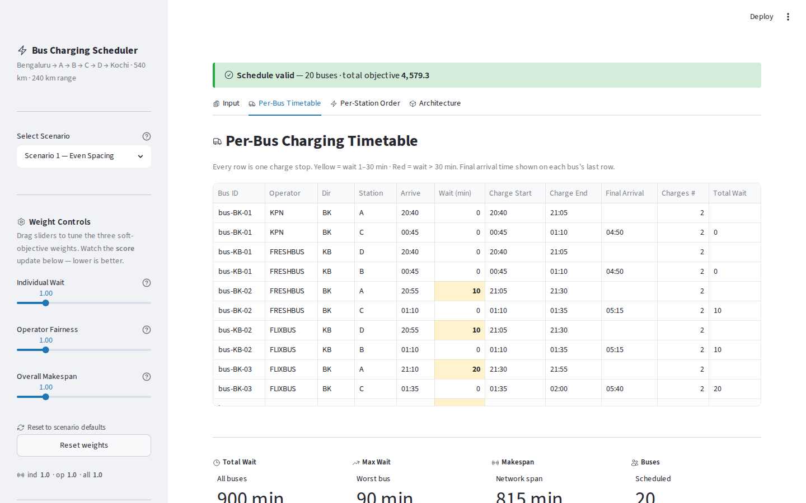
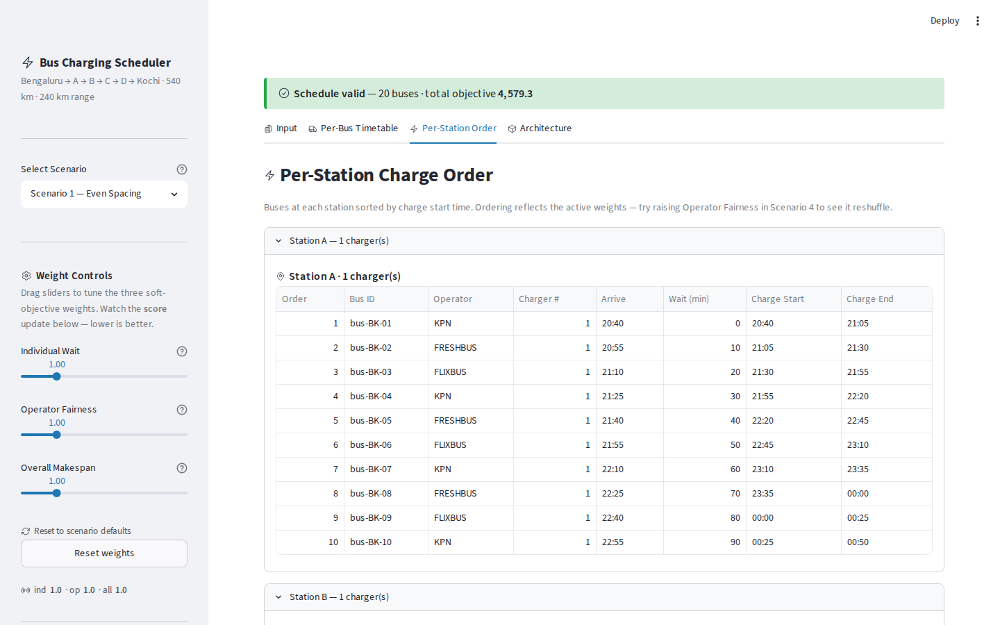
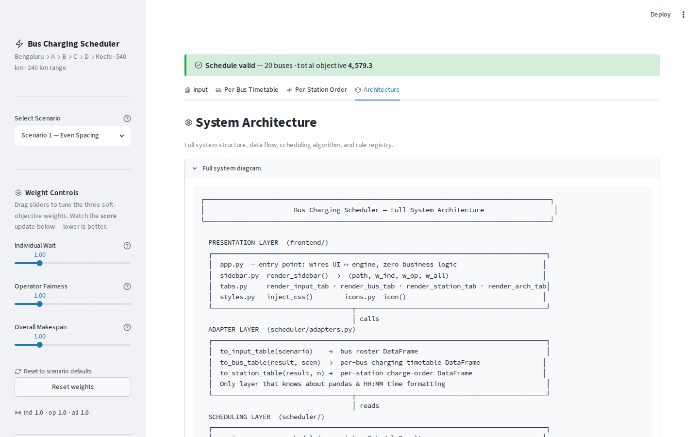

# ⚡ Bus Charging Scheduler

> **Electric bus charging scheduler for the Bengaluru – Kochi corridor.**
> Decides which stations each bus charges at, who waits when chargers clash,
> and produces a complete per-bus timetable and per-station charge order -
> all in a single Python + Streamlit app.


&nbsp;


**Live app:** https://bus-charging-scheduler.streamlit.app

**GitHub:** https://github.com/RhythmItaliya/Bus-charging-scheduler

**Built by:** [rhythmitaliya](https://github.com/RhythmItaliya)

---

## Screenshots

### Input tab - scenario overview and bus roster


### Per-Bus Timetable - full charging timeline for every bus


### Per-Station Order - charge queue at each of the 4 stations


### Architecture tab - live system diagram and rule registry


---

## What it does

Electric buses run the **Bengaluru → A → B → C → D → Kochi** corridor (540 km).
Each bus starts fully charged but can only travel **240 km** before needing a charge.
With a 540 km trip, every bus must charge at least **twice** along the way.

The scheduler:
- **Picks which stations** each bus charges at (from the valid range-feasible plans)
- **Resolves queue conflicts** when multiple buses want the same 1-charger station
- **Optimises** using three tunable weighted soft objectives (individual wait, operator fairness, network makespan)
- **Validates** every schedule against all four hard rules before displaying it
- **Shows** the result in a 4-tab Streamlit UI and a rich-formatted terminal output

---

## The route

```
Bengaluru ──100 km── A ──120 km── B ──100 km── C ──120 km── D ──100 km── Kochi
   (start)                                                              (end)
                     ↑           ↑            ↑           ↑
                 Station A    Station B    Station C    Station D
                 1 charger    1 charger    1 charger    1 charger
```

**Valid charging plans for a Bengaluru → Kochi bus** (240 km range, 540 km trip):

| Plan | Leg 1 | Leg 2 | Leg 3 |
|------|-------|-------|-------|
| A → C | 100 km ✓ | 220 km ✓ | 220 km ✓ |
| B → C | 220 km ✓ | 100 km ✓ | 220 km ✓ |
| B → D | 220 km ✓ | 220 km ✓ | 100 km ✓ |
| ~~A → D~~ | 100 km ✓ | **340 km ✗** | - | ← INVALID, exceeds range |

---

## The 5 scenarios

| # | Name | Buses | Weights `ind/op/all` | Key test |
|---|------|-------|---------------------|----------|
| 1 | Even Spacing | 10 BK + 10 KB, 15 min apart | 1 / 1 / 1 | Baseline |
| 2 | Bunched Start | 8 min apart then spaced out | 1 / 1 / 1 | Heavy early contention |
| 3 | Asymmetric | 10 BK, only 4 KB | 1 / 1 / 1 | Lopsided charger demand |
| 4 | Operator-Heavy | KPN = 8 of 10 BK buses | 1 / **2** / 1 | Operator fairness weight |
| 5 | Worst-Case | 8 min apart, all 20 buses | 1 / 1 / 1 | Maximum convergence |

---

## Quick start

```bash
git clone https://github.com/RhythmItaliya/Bus-charging-scheduler.git
cd Bus-charging-scheduler

python -m venv .venv
source .venv/bin/activate        # Windows: .venv\Scripts\activate

pip install -r requirements.txt

streamlit run app.py
```

Open `http://localhost:8501` in your browser.

### Run the scheduler from the terminal (CLI demo)

```bash
python -m scheduler.engine data/scenarios/scenario_1.json
```

This prints a full scheduling walkthrough using the **rich** library -
beautiful coloured panels, per-bus commit lines, station tables, and the objective score breakdown.
Great for understanding exactly how the algorithm works step by step.

---

## How to change a weight

### In the UI
Drag any of the three sliders in the sidebar. The schedule recalculates instantly.
Click **Reset weights** to restore the scenario's file defaults.

### In the scenario JSON (permanent change)

Open `data/scenarios/scenario_4.json` and edit the `weights` object:

```json
"weights": {
  "individual": 1.0,
  "operator": 2.0,   ← change this number
  "overall":  1.0
}
```

That is the **entire change**. No Python code is touched.
The engine reads weights via `ctx.weights.get("operator")` - never a hardcoded value.

---

## How to add a new rule

Create one file in `scheduler/rules/`. The engine autodiscovers it automatically.

```python
# scheduler/rules/electricity.py
from scheduler.rules.registry import Rule, ScheduleContext, register

@register
class ElectricityCostRule(Rule):
    """Penalise charging during peak tariff window (18:00 – 22:00)."""
    name = "ElectricityCostRule"
    kind = "soft"            # "hard" returns math.inf to reject the plan
    weight_key = "electricity_cost"

    PEAK_START = 1080        # 18:00 in minutes from midnight
    PEAK_END   = 1320        # 22:00

    def evaluate(self, ctx: ScheduleContext) -> float:
        weight = ctx.weights.get(self.weight_key)   # reads from scenario JSON
        penalty = 0.0
        for evt in ctx.charge_events:
            if self.PEAK_START <= evt["start_min"] < self.PEAK_END:
                penalty += ctx.scenario.world.charge_minutes * 2.0
        return weight * penalty
```

Then add `"electricity_cost": 1.0` to the scenario's `weights` block. Done - no other files change.

---

## How to encode a new scenario

Copy any existing scenario file, change the `name`, and replace the `buses` list.

**Time → minutes converter:**
```
19:00 = 1140    19:15 = 1155    19:30 = 1170    19:45 = 1185
20:00 = 1200    20:15 = 1215    20:30 = 1230    20:45 = 1245
21:00 = 1260    21:15 = 1275

Formula:  hours × 60 + minutes = departure_min
Example:  20:25  →  20 × 60 + 25  =  1225
```

The app discovers new JSON files in `data/scenarios/` automatically on the next load.

---

## Project layout

```
bus-charging-scheduler/
│
├── app.py                  ← Streamlit entry point - wires UI to engine (thin layer)
├── requirements.txt        ← streamlit + pandas + rich
├── ARCHITECTURE.md         ← framework choice, data model, change-foresight table, assumptions
├── pytest.ini
│
├── frontend/               ← UI rendering (all Streamlit code lives here)
│   ├── sidebar.py          ← scenario dropdown + weight sliders + reset button
│   ├── tabs.py             ← 4 tab renderers (Input, Per-Bus, Per-Station, Architecture)
│   ├── styles.py           ← CSS injection + tab icons
│   └── icons.py            ← inline SVG icon library
│
├── scheduler/              ← pure-Python engine (zero Streamlit imports - fully headless)
│   ├── config.py           ← centralised defaults (speed 60 km/h, range 240 km, charge 25 min)
│   ├── model.py            ← immutable frozen dataclasses (Scenario, Bus, BusPlan, etc.)
│   ├── physics.py          ← travel time arithmetic, minutes→HH:MM formatter
│   ├── loader.py           ← JSON parser + 3-stage input validation → Scenario
│   ├── plans.py            ← range-feasible charging plan enumeration per bus
│   ├── resources.py        ← ChargerPool: reserve / snapshot / restore
│   ├── objective.py        ← generic rule aggregator (hard first, then soft)
│   ├── engine.py           ← deterministic greedy scheduler (the core algorithm)
│   ├── validate.py         ← post-schedule hard-rule checker (H1 H2 H3 H4 R15)
│   ├── logger.py           ← rich-based structured coloured logger
│   ├── adapters.py         ← ScheduleResult → pandas DataFrames for the UI
│   └── rules/
│       ├── registry.py     ← Rule ABC, RuleRegistry, @register decorator
│       ├── hard_rules.py   ← H1 RangeRule · H2 RouteOrderRule · H4 ChargeDurationRule
│       ├── soft_rules.py   ← S1 IndividualWaitRule · S2 OperatorRule · S3 OverallRule
│       └── _discover.py    ← auto-imports every rule module at package import time
│
├── data/
│   └── scenarios/
│       ├── scenario_1.json ← Even spacing    (20 buses, weights 1/1/1)
│       ├── scenario_2.json ← Bunched start   (20 buses, weights 1/1/1)
│       ├── scenario_3.json ← Asymmetric load (14 buses, weights 1/1/1)
│       ├── scenario_4.json ← Operator-heavy  (20 buses, weights 1/2/1)
│       └── scenario_5.json ← Worst-case      (20 buses, weights 1/1/1)
│
├── screenshots/            ← UI screenshots for this README
│   ├── 01-input-tab.png
│   ├── 02-bus-timetable.png
│   ├── 03-station-order.png
│   ├── 04-architecture.png
│   └── 05-scenario4-station.png
│
├── tests/
│   ├── test_physics.py     ← travel time, HH:MM formatter
│   ├── test_plans.py       ← plan enumeration + BK/KB validity sets
│   ├── test_charger.py     ← ChargerPool unit + H3 exclusivity across scenarios
│   ├── test_rules.py       ← H1/H2/H4 violations; S1/S2/S3 penalty + weight scaling
│   ├── test_e2e.py         ← all 5 scenarios: validate()==[], ≥2 charges, determinism
│   └── test_weights.py     ← Scenario 4: objective changes with operator weight
│
└── docs/                   ← Engineering blueprints (47 markdown files)
    ├── README.md           ← How to navigate + reading order for AI build agents
    ├── 00-requirements/    ← Requirements analysis, constraints, traceability
    ├── 01-architecture/    ← System architecture, components, design decisions
    ├── 02-scheduler-engine/← Scheduling logic, allocation, optimisation, rule framework
    ├── 03-data-model/      ← Domain model, scenario schema, output schema
    ├── 04-api-contracts/   ← Internal module contracts, validation rules
    ├── 05-frontend/        ← Streamlit UI flow + component acceptance criteria
    ├── 06-backend/         ← Backend service responsibilities
    ├── 07-testing/         ← Test plan + edge cases
    ├── 08-devops/          ← Deployment to Streamlit Community Cloud + CI
    ├── 09-security/        ← Threat model
    ├── 10-observability/   ← Logging + decision transparency
    └── 11-submission/      ← Interview prep guide + demo scripts
```

---

## Hard rules (always enforced)

| Rule | What it checks | Returns if violated |
|------|----------------|---------------------|
| H1 RangeRule | No leg exceeds bus battery range (240 km) | `math.inf` → plan rejected |
| H2 RouteOrderRule | Stations visited in travel order, no backtracking | `math.inf` → plan rejected |
| H3 ChargerExclusivity | ≤ `num_chargers` buses charging simultaneously | Enforced by ChargerPool |
| H4 ChargeDurationRule | Every charge is exactly `world.charge_minutes` | `math.inf` → plan rejected |

## Soft rules (weighted objectives)

| Rule | What it measures | Weight key |
|------|-----------------|------------|
| S1 IndividualWaitRule | `w × Σ(wait per bus)` - minimise total queue time | `individual` |
| S2 OperatorRule | `w × Σ(fleet variance)` - equalise wait within each operator | `operator` |
| S3 OverallRule | `w × makespan` - compress total operation window | `overall` |

---

## Run tests

```bash
pytest
```

All **103 tests** pass. Key assertions:
- `validate() == []` for all five scenarios
- Every bus has ≥ 2 charge events (540 km trip, 240 km range)
- H1/H2/H4 return `math.inf` for a violating plan; `0.0` for a valid one
- S1/S2/S3 return higher penalty for worse inputs; doubling the weight doubles the penalty
- Scenario 4 objective value changes when `operator` weight changes

---

## Architecture overview

```
app.py (Streamlit entry)
  └── frontend/        - sidebar, tabs, CSS, icons
        └── adapters   - engine output → DataFrames (only pandas user)
              └── scheduler/engine  - greedy scheduler
                    ├── plans.py    - enumerate feasible charging plans
                    ├── resources.py- ChargerPool (H3 enforcement)
                    ├── objective.py- generic rule scorer
                    └── rules/      - pluggable hard + soft rules
                          └── [drop a file + @register → autodiscovered]

Lower layers never import higher layers.
scheduler/* has zero Streamlit imports - runs headless from the CLI.
```

Full diagram with data flow: see `ARCHITECTURE.md` and the **Architecture** tab in the app.

---

## Assumptions

All assumptions are documented in `ARCHITECTURE.md § Assumptions` with reasoning.

| Assumption | Value |
|------------|-------|
| Travel speed | 60 km/h constant (100 km = 100 min - clean arithmetic) |
| Charge duration | Always exactly 25 minutes, always to full |
| Endpoints | Bengaluru and Kochi are not charging stations |
| Scheduling | Greedy (locally optimal per bus) - not globally optimal |
| Tie-break | Priority DESC → departure\_min ASC → bus ID ASC |
| Clock | Minutes from midnight - no midnight-wrap bugs (e.g. 01:00 = 1500 min) |

---

## Built by

**[rhythmitaliya](https://github.com/RhythmItaliya)** - Python · Streamlit · rich
