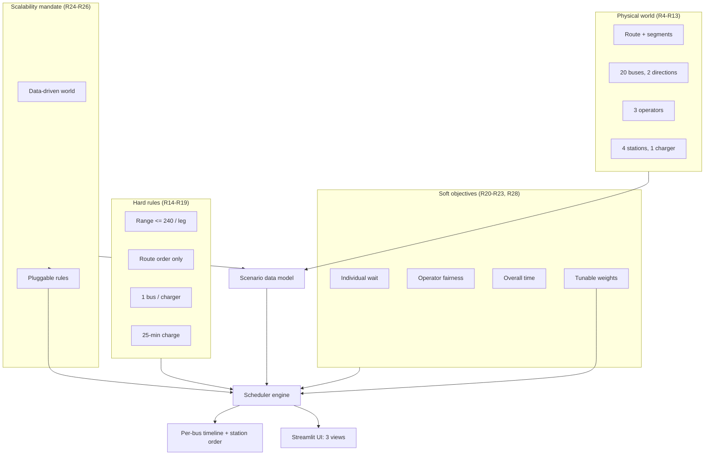

# Diagram — Requirements Map

How the requirement clusters drive the design.

```mermaid
flowchart TB
    subgraph World["Physical world (R4-R13)"]
        Route[Route + segments]
        Buses[20 buses, 2 directions]
        Ops[3 operators]
        Stations[4 stations, 1 charger]
    end
    subgraph Hard["Hard rules (R14-R19)"]
        Range[Range <= 240 / leg]
        Order[Route order only]
        Excl[1 bus / charger]
        Dur[25-min charge]
    end
    subgraph Soft["Soft objectives (R20-R23, R28)"]
        Ind[Individual wait]
        Opr[Operator fairness]
        All[Overall time]
        W[Tunable weights]
    end
    subgraph Scale["Scalability mandate (R24-R26)"]
        Data[Data-driven world]
        Plug[Pluggable rules]
    end
    World --> DataModel[Scenario data model]
    Hard --> Engine[Scheduler engine]
    Soft --> Engine
    W --> Engine
    DataModel --> Engine
    Scale --> DataModel
    Scale --> Plug
    Plug --> Engine
    Engine --> UI[Streamlit UI: 3 views]
    Engine --> Out[Per-bus timeline + station order]
```
