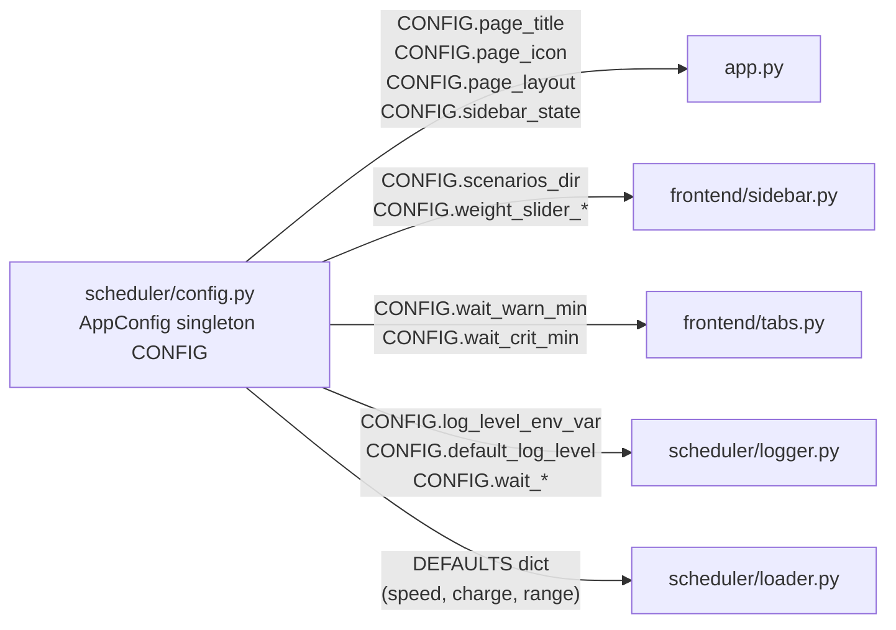

# Configuration Guide

**Purpose.** One file manages every tunable constant in the project.
This doc tells you exactly what lives in `scheduler/config.py`, why it is there,
and how to change anything without hunting through multiple files.

---

## The rule

> **Every configurable value lives in `scheduler/config.py` once.**
> No file except `config.py` may contain a raw literal for a value that might change.

This extends the PDF's own mandate ("Changing a weight must be trivial — a value in one obvious
place, not scattered across code") to every value in the system, not just rule weights.

---

## How to use it

```python
from scheduler.config import CONFIG

CONFIG.scenarios_dir       # "data/scenarios"
CONFIG.speed_kmph          # 60.0
CONFIG.page_title          # "Bus Charging Scheduler"
CONFIG.weight_slider_max   # 5.0
CONFIG.wait_crit_min       # 30
CONFIG.log_level_env_var   # "BCS_LOG_LEVEL"
```

`CONFIG` is a frozen `AppConfig` dataclass — a module-level singleton defined in `config.py`.
Frozen means nothing in the codebase can accidentally overwrite a config value at runtime.

---

## All configurable values

### Physical world defaults

These are fallback values used by `loader.py` when a scenario JSON omits the `"world"` block.
A scenario file can always override them per-scenario.

| Field | Default | What it controls |
|-------|---------|-----------------|
| `speed_kmph` | `60.0` | Travel speed; `100 km / 60 km/h = 100 min` |
| `charge_minutes` | `25` | Hard rule H4: every charge is exactly this many minutes |
| `battery_range_km` | `240.0` | Hard rule H1: max km between charges |
| `default_weight` | `1.0` | Fallback multiplier for any weight not in scenario JSON |

### Paths

| Field | Default | What it controls |
|-------|---------|-----------------|
| `scenarios_dir` | `"data/scenarios"` | Directory where `*.json` scenario files are discovered |

### Logging

| Field | Default | What it controls |
|-------|---------|-----------------|
| `log_level_env_var` | `"BCS_LOG_LEVEL"` | Name of the env var that sets terminal verbosity |
| `default_log_level` | `"INFO"` | Level used when the env var is absent |

```bash
# See every charger reservation and plan evaluation:
BCS_LOG_LEVEL=DEBUG python -m scheduler.engine data/scenarios/scenario_1.json

# Suppress all output (clean CI):
BCS_LOG_LEVEL=ERROR pytest -q
```

Valid levels: `DEBUG`, `INFO`, `WARN`, `ERROR`.

### UI — Streamlit page settings

| Field | Default | What it controls |
|-------|---------|-----------------|
| `page_title` | `"Bus Charging Scheduler"` | Browser tab title |
| `page_icon` | `"⚡"` | Browser tab favicon |
| `page_layout` | `"wide"` | Streamlit layout mode |
| `sidebar_state` | `"expanded"` | Sidebar open on first load |

### UI — Weight sliders

All three weight sliders (Individual, Operator, Overall) share the same bounds.
Change once here to apply to all three simultaneously.

| Field | Default | What it controls |
|-------|---------|-----------------|
| `weight_slider_min` | `0.0` | Minimum value (`0.0` = rule fully silenced) |
| `weight_slider_max` | `5.0` | Maximum value |
| `weight_slider_step` | `0.5` | Slider increment |

### UI — Wait time colour thresholds

These drive the yellow/red colour coding in both the Streamlit tables
and the rich terminal output. One value, consumed in three places.

| Field | Default | What it controls |
|-------|---------|-----------------|
| `wait_warn_min` | `1` | Waits `>=` this are shown yellow (moderate queue) |
| `wait_crit_min` | `30` | Waits `>` this are shown red (long queue, high S1 cost) |

---

## How to change a value

**Example: raise the red threshold from 30 to 45 minutes.**

```python
# scheduler/config.py — ONE edit, affects ALL of:
#   frontend/tabs.py   _highlight_wait()
#   scheduler/logger.py  schedule(), schedule_table(), bus_committed()

@dataclass(frozen=True)
class AppConfig:
    ...
    wait_crit_min: int = 45   # was 30
```

That is the complete change. No hunting across tabs.py and logger.py.

**Example: add a new slider range for a future "priority weight" slider.**

```python
@dataclass(frozen=True)
class AppConfig:
    ...
    priority_slider_min: float = 0.0
    priority_slider_max: float = 10.0
    priority_slider_step: float = 1.0
```

Then in `frontend/sidebar.py`:
```python
w_priority = st.slider(
    "Priority Boost",
    min_value=CONFIG.priority_slider_min,
    max_value=CONFIG.priority_slider_max,
    step=CONFIG.priority_slider_step,
    value=0.0,
)
```

---

## Backward-compatible aliases

These module-level names are kept so that older import sites continue to work:

| Alias | Points to | Used by |
|-------|-----------|---------|
| `DEFAULTS` | dict derived from CONFIG fields | `scheduler/loader.py` |
| `SCENARIOS_DIR` | `CONFIG.scenarios_dir` | legacy imports |
| `DEFAULT_WEIGHT` | `CONFIG.default_weight` | legacy imports |

New code should always import `CONFIG` directly — never use the alias names in new files.

---

## What does NOT belong in config

| Not in config | Reason |
|---------------|--------|
| Rule weights (`individual`, `operator`, `overall`) | User-controlled per scenario JSON; tunable via UI slider |
| Operator names, station names | Always derived from scenario data; never hardcoded |
| Battery range per bus | Per-bus field `Bus.range_km`; can differ from world default |
| Any value that changes per session | Config is frozen; runtime state belongs elsewhere |

---

## Diagram


