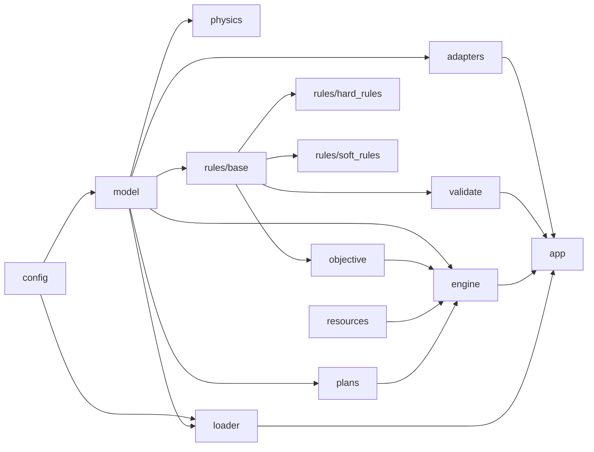

# Diagram — Component Dependency Graph

```mermaid
graph LR
    config --> model
    model --> physics
    model --> plans
    model --> rules_base[rules/base]
    rules_base --> hard[rules/hard_rules]
    rules_base --> soft[rules/soft_rules]
    model --> loader
    config --> loader
    plans --> engine
    resources --> engine
    objective --> engine
    rules_base --> objective
    model --> engine
    rules_base --> validate
    model --> adapters
    loader --> app
    engine --> app
    validate --> app
    adapters --> app
```
