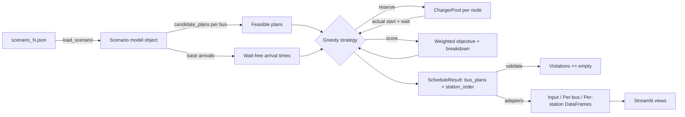

# Diagram — End-to-End Data Flow

```mermaid
flowchart LR
    A[scenario_N.json] -->|load_scenario| B[Scenario model object]
    B -->|candidate_plans per bus| C[Feasible plans]
    B -->|base arrivals| D[Wait-free arrival times]
    C --> E{Greedy strategy}
    D --> E
    E -->|reserve| F[ChargerPool per node]
    F -->|actual start + wait| E
    E -->|score| G[Weighted objective + breakdown]
    G --> E
    E --> H[ScheduleResult: bus_plans + station_order]
    H -->|validate| I[Violations == empty]
    H -->|adapters| J[Input / Per-bus / Per-station DataFrames]
    J --> K[Streamlit views]
```
