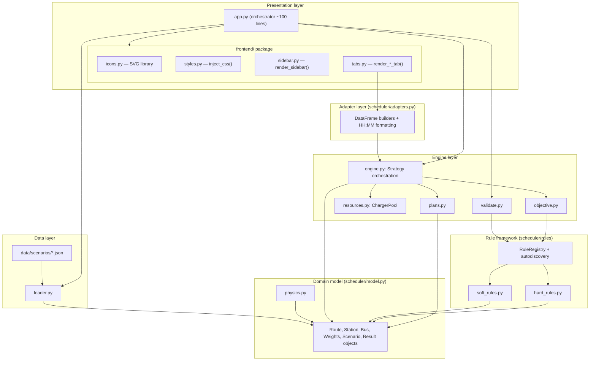

# Diagram — System Architecture (layers)

```mermaid
flowchart TD
    subgraph Presentation["Presentation layer"]
        APP["app.py (orchestrator ~100 lines)"]
        subgraph Frontend["frontend/ package"]
            ICO["icons.py — SVG library"]
            STY["styles.py — inject_css()"]
            SID["sidebar.py — render_sidebar()"]
            TAB["tabs.py — render_*_tab()"]
        end
    end
    subgraph Adapters["Adapter layer (scheduler/adapters.py)"]
        AD[DataFrame builders + HH:MM formatting]
    end
    subgraph Engine["Engine layer"]
        ENG[engine.py: Strategy orchestration]
        PLN[plans.py]
        RES[resources.py: ChargerPool]
        OBJ[objective.py]
        VAL[validate.py]
    end
    subgraph Rules["Rule framework (scheduler/rules)"]
        REG[RuleRegistry + autodiscovery]
        HARD[hard_rules.py]
        SOFT[soft_rules.py]
    end
    subgraph Domain["Domain model (scheduler/model.py)"]
        MOD[Route, Station, Bus, Weights, Scenario, Result objects]
        PHY[physics.py]
    end
    subgraph Data["Data layer"]
        FILES[data/scenarios/*.json]
        LOAD[loader.py]
    end

    APP --> Frontend
    APP --> ENG
    APP --> VAL
    APP --> LOAD
    TAB --> AD
    AD --> ENG
    ENG --> PLN --> MOD
    ENG --> RES
    ENG --> OBJ --> REG
    REG --> HARD --> MOD
    REG --> SOFT --> MOD
    ENG --> MOD
    PHY --> MOD
    VAL --> REG
    FILES --> LOAD --> MOD
```

> Dependency arrows point downward only. Nothing in `scheduler/` imports `frontend/` or `app.py`.
> Only `app.py` and `frontend/` import Streamlit.
