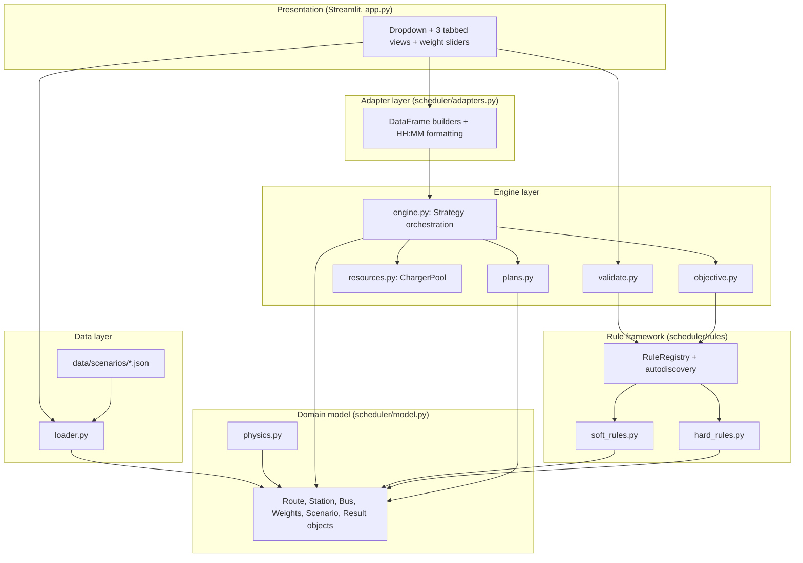

# Diagram — System Architecture (layers)

```mermaid
flowchart TD
    subgraph Presentation["Presentation (Streamlit, app.py)"]
        UI[Dropdown + 3 tabbed views + weight sliders]
    end
    subgraph Adapters["Adapter layer (scheduler/adapters.py)"]
        AD[DataFrame builders + HH:MM formatting]
    end
    subgraph Engine["Engine layer"]
        ENG[engine.py: Strategy orchestration]
        PLN[plans.py]
        RES[resources.py: ChargerPool]
        OBJ[objective.py]
        VAL[validate.py]
    end
    subgraph Rules["Rule framework (scheduler/rules)"]
        REG[RuleRegistry + autodiscovery]
        HARD[hard_rules.py]
        SOFT[soft_rules.py]
    end
    subgraph Domain["Domain model (scheduler/model.py)"]
        MOD[Route, Station, Bus, Weights, Scenario, Result objects]
        PHY[physics.py]
    end
    subgraph Data["Data layer"]
        FILES[data/scenarios/*.json]
        LOAD[loader.py]
    end
    UI --> AD --> ENG
    ENG --> PLN --> MOD
    ENG --> RES
    ENG --> OBJ --> REG
    REG --> HARD --> MOD
    REG --> SOFT --> MOD
    ENG --> MOD
    PHY --> MOD
    UI --> VAL --> REG
    FILES --> LOAD --> MOD
    UI --> LOAD
```

> Dependency arrows point downward only. Nothing below imports anything above it.
