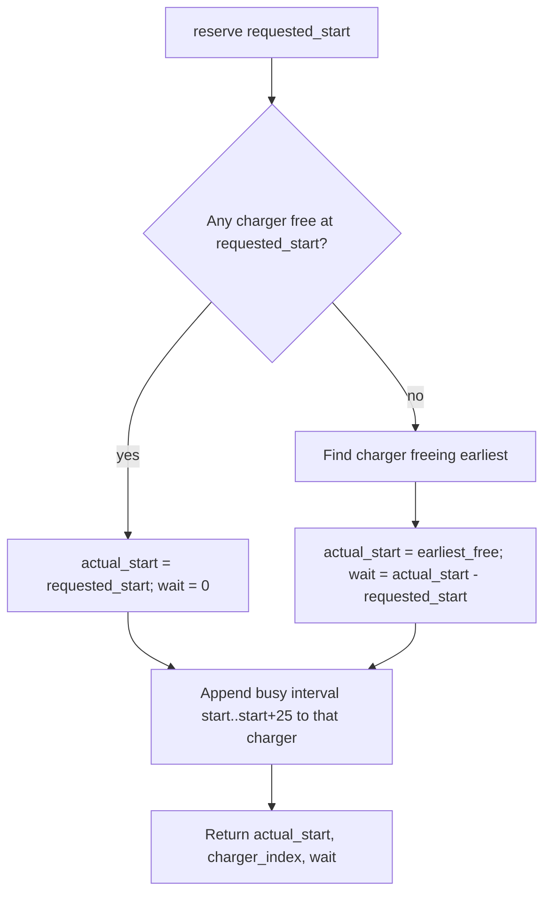

# Diagram — Charging Allocation (ChargerPool.reserve)

```mermaid
flowchart TD
    Req[reserve requested_start] --> Free{Any charger free at requested_start?}
    Free -->|yes| Now[actual_start = requested_start; wait = 0]
    Free -->|no| Soon[Find charger freeing earliest]
    Soon --> Wait[actual_start = earliest_free; wait = actual_start - requested_start]
    Now --> Book[Append busy interval start..start+25 to that charger]
    Wait --> Book
    Book --> Ret[Return actual_start, charger_index, wait]
```
