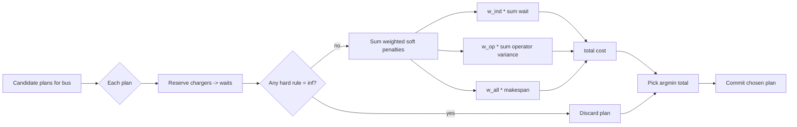

# Diagram — Optimization Decision

```mermaid
flowchart LR
    Plans[Candidate plans for bus] --> Each{Each plan}
    Each --> R[Reserve chargers -> waits]
    R --> Hard{Any hard rule = inf?}
    Hard -->|yes| Drop[Discard plan]
    Hard -->|no| Soft[Sum weighted soft penalties]
    Soft --> Ind[w_ind * sum wait]
    Soft --> Op[w_op * sum operator variance]
    Soft --> All[w_all * makespan]
    Ind --> Tot[total cost]
    Op --> Tot
    All --> Tot
    Tot --> Min[Pick argmin total]
    Drop --> Min
    Min --> Commit[Commit chosen plan]
```
