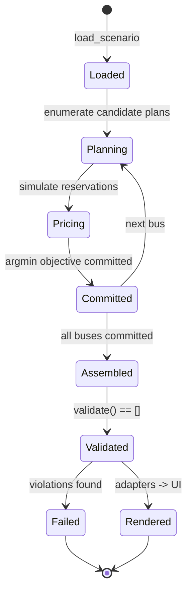

# Diagram — State Management (commit lifecycle)

```mermaid
stateDiagram-v2
    [*] --> Loaded: load_scenario
    Loaded --> Planning: enumerate candidate plans
    Planning --> Pricing: simulate reservations
    Pricing --> Committed: argmin objective committed
    Committed --> Planning: next bus
    Committed --> Assembled: all buses committed
    Assembled --> Validated: validate() == []
    Validated --> Rendered: adapters -> UI
    Validated --> Failed: violations found
    Failed --> [*]
    Rendered --> [*]
```
