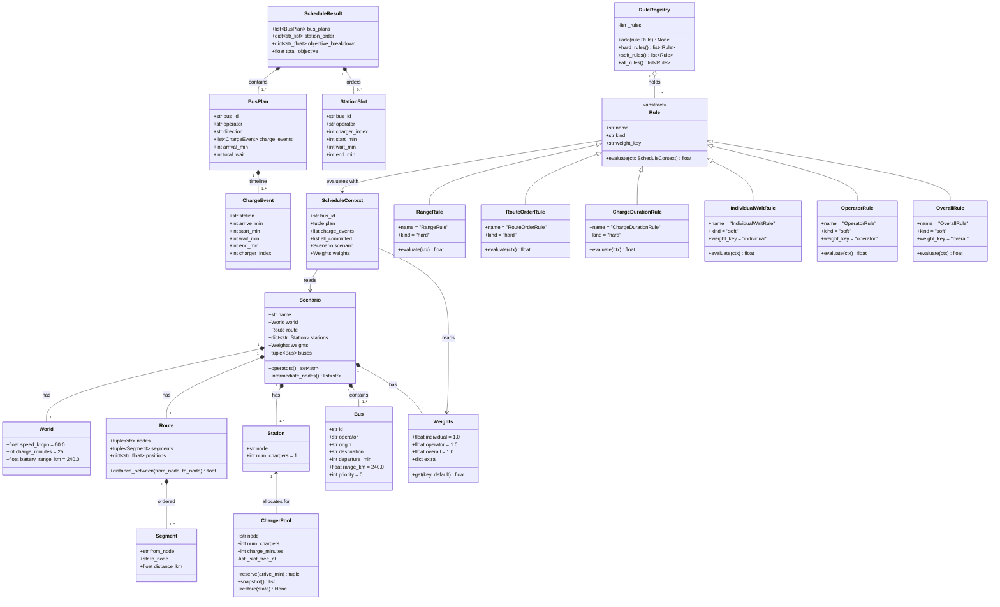

# Diagram — Full Python Class Diagram

All dataclasses, domain objects, rule classes, and runtime resources.
This is the canonical class reference for an AI agent or developer building or extending this project.



## Field contracts

| Class | Invariant |
|-------|-----------|
| `ChargeEvent` | `wait_min == start_min - arrive_min` |
| `ChargeEvent` | `end_min  == start_min + world.charge_minutes` |
| `BusPlan`     | `total_wait == sum(e.wait_min for e in charge_events)` |
| `Route`       | `positions[nodes[0]] == 0.0`; positions are cumulative distances |
| `Bus`         | `range_km > 0`; `departure_min >= 0` |
| `Weights`     | All fields ≥ 0.0; `extra` may be empty |
| `ChargerPool` | `len(_slot_free_at) == num_chargers` at all times |

## Adding a new rule (live demo pattern)

```python
# scheduler/rules/electricity.py
from scheduler.rules.registry import Rule, ScheduleContext, register

@register
class ElectricityCostRule(Rule):
    name = "ElectricityCostRule"
    kind = "soft"
    weight_key = "electricity_cost"

    def evaluate(self, ctx: ScheduleContext) -> float:
        weight = ctx.weights.get(self.weight_key)
        night_charges = sum(
            1 for e in ctx.charge_events
            if 0 <= (e.start_min % 1440) < 360   # 00:00–06:00 is cheaper
        )
        # Penalise off-peak to incentivise daytime charging
        return weight * (len(ctx.charge_events) - night_charges)
```
Drop the file — `_discover.py` picks it up. Zero engine changes.
