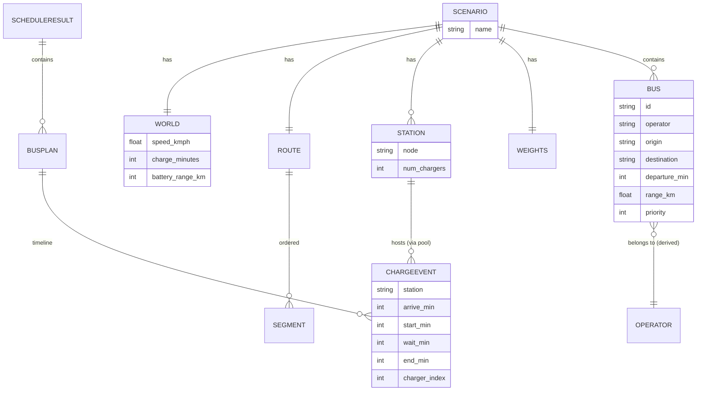

# Diagram — Domain Entity Relationships

```mermaid
erDiagram
    SCENARIO ||--|| WORLD : has
    SCENARIO ||--|| ROUTE : has
    SCENARIO ||--o{ STATION : has
    SCENARIO ||--|| WEIGHTS : has
    SCENARIO ||--o{ BUS : contains
    ROUTE ||--o{ SEGMENT : ordered
    BUS }o--|| OPERATOR : "belongs to (derived)"
    SCHEDULERESULT ||--o{ BUSPLAN : contains
    BUSPLAN ||--o{ CHARGEEVENT : timeline
    STATION ||--o{ CHARGEEVENT : "hosts (via pool)"
    SCENARIO {
      string name
    }
    WORLD {
      float speed_kmph
      int charge_minutes
      int battery_range_km
    }
    STATION {
      string node
      int num_chargers
    }
    BUS {
      string id
      string operator
      string origin
      string destination
      int departure_min
      float range_km
      int priority
    }
    CHARGEEVENT {
      string station
      int arrive_min
      int start_min
      int wait_min
      int end_min
      int charger_index
    }
```
