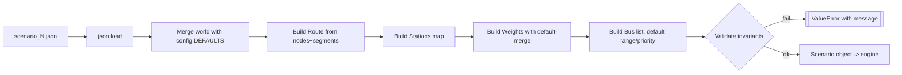

# Diagram — Scenario Data Flow (file to model)

```mermaid
flowchart LR
    J[scenario_N.json] --> P[json.load]
    P --> MW[Merge world with config.DEFAULTS]
    MW --> BR[Build Route from nodes+segments]
    BR --> BS[Build Stations map]
    BS --> BW[Build Weights with default-merge]
    BW --> BB[Build Bus list, default range/priority]
    BB --> V{Validate invariants}
    V -->|fail| E[[ValueError with message]]
    V -->|ok| S[Scenario object -> engine]
```
