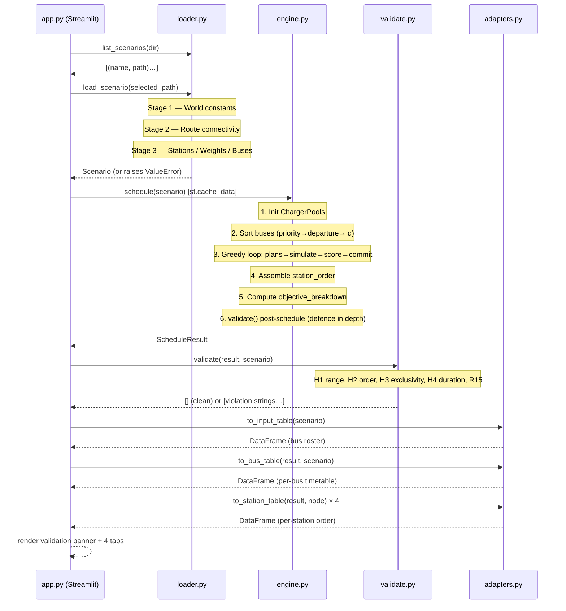

# Diagram — API Interaction (internal call sequence)

## Public API contracts

| Function | Signature | Returns | Raises |
|----------|-----------|---------|--------|
| `list_scenarios` | `(directory: str\|Path) → list[tuple[str, Path]]` | Sorted `(name, path)` pairs | `FileNotFoundError` |
| `load_scenario` | `(path: str\|Path) → Scenario` | Fully validated `Scenario` | `ValueError`, `FileNotFoundError`, `json.JSONDecodeError` |
| `schedule` | `(scenario: Scenario) → ScheduleResult` | Complete committed schedule | `ValueError` (no plan), `RuntimeError` (validation failed) |
| `validate` | `(result: ScheduleResult, scenario: Scenario) → list[str]` | Empty = valid; non-empty = violations | — |
| `to_input_table` | `(scenario) → pd.DataFrame` | Bus roster with HH:MM departure | — |
| `to_bus_table` | `(result, scenario) → pd.DataFrame` | Per-bus charging timetable | — |
| `to_station_table` | `(result, node) → pd.DataFrame` | Charge order at one station | — |
