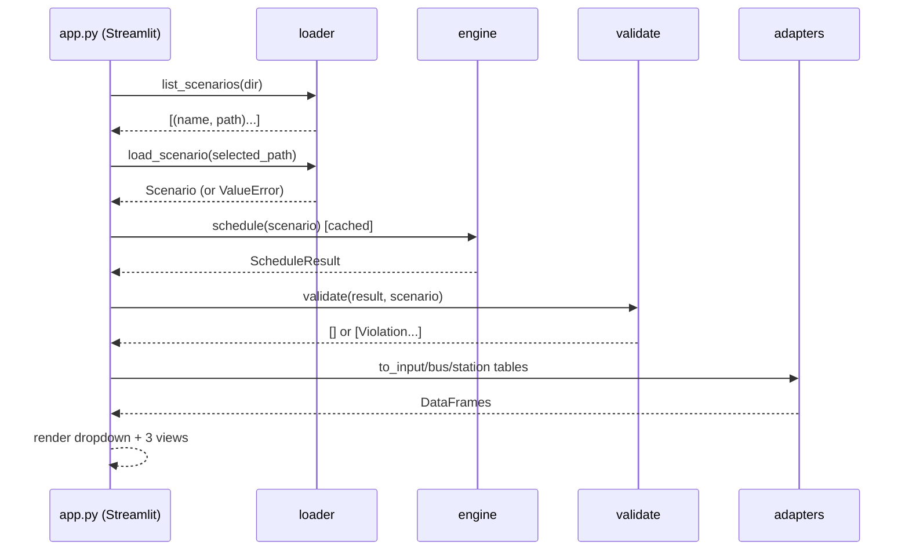

# Diagram — API Interaction (internal call sequence)

```mermaid
sequenceDiagram
    participant UI as app.py (Streamlit)
    participant L as loader
    participant E as engine
    participant V as validate
    participant A as adapters
    UI->>L: list_scenarios(dir)
    L-->>UI: [(name, path)...]
    UI->>L: load_scenario(selected_path)
    L-->>UI: Scenario (or ValueError)
    UI->>E: schedule(scenario)  [cached]
    E-->>UI: ScheduleResult
    UI->>V: validate(result, scenario)
    V-->>UI: [] or [Violation...]
    UI->>A: to_input/bus/station tables
    A-->>UI: DataFrames
    UI-->>UI: render dropdown + 3 views
```
