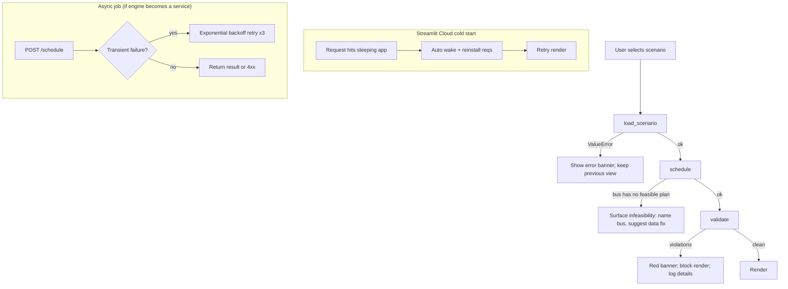

# Diagram — Retry & Fallback Semantics

The app is synchronous, but three retry/fallback paths exist and must be handled.

```mermaid
flowchart TD
    A[User selects scenario] --> B[load_scenario]
    B -->|ValueError| B1[Show error banner; keep previous view]
    B -->|ok| C[schedule]
    C -->|bus has no feasible plan| C1[Surface infeasibility: name bus, suggest data fix]
    C -->|ok| D[validate]
    D -->|violations| D1[Red banner; block render; log details]
    D -->|clean| E[Render]
    subgraph Hosting["Streamlit Cloud cold start"]
        F[Request hits sleeping app] --> G[Auto wake + reinstall reqs]
        G --> H[Retry render]
    end
    subgraph Future["Async job (if engine becomes a service)"]
        I[POST /schedule] --> J{Transient failure?}
        J -->|yes| K[Exponential backoff retry x3]
        J -->|no| L[Return result or 4xx]
    end
```
