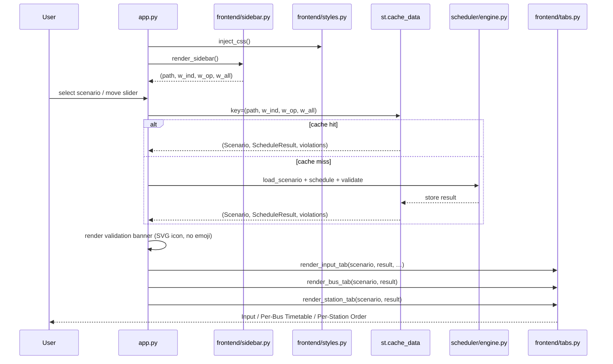

# Diagram — Render Sequence

```mermaid
sequenceDiagram
    participant U as User
    participant App as app.py
    participant SID as frontend/sidebar.py
    participant CSS as frontend/styles.py
    participant Cache as st.cache_data
    participant ENG as scheduler/engine.py
    participant TAB as frontend/tabs.py

    App->>CSS: inject_css()
    App->>SID: render_sidebar()
    SID-->>App: (path, w_ind, w_op, w_all)

    U->>App: select scenario / move slider

    App->>Cache: key=(path, w_ind, w_op, w_all)
    alt cache hit
        Cache-->>App: (Scenario, ScheduleResult, violations)
    else cache miss
        App->>ENG: load_scenario + schedule + validate
        ENG-->>Cache: store result
        Cache-->>App: (Scenario, ScheduleResult, violations)
    end

    App->>App: render validation banner (SVG icon, no emoji)

    App->>TAB: render_input_tab(scenario, result, …)
    App->>TAB: render_bus_tab(scenario, result)
    App->>TAB: render_station_tab(scenario, result)
    TAB-->>U: Input / Per-Bus Timetable / Per-Station Order
```
