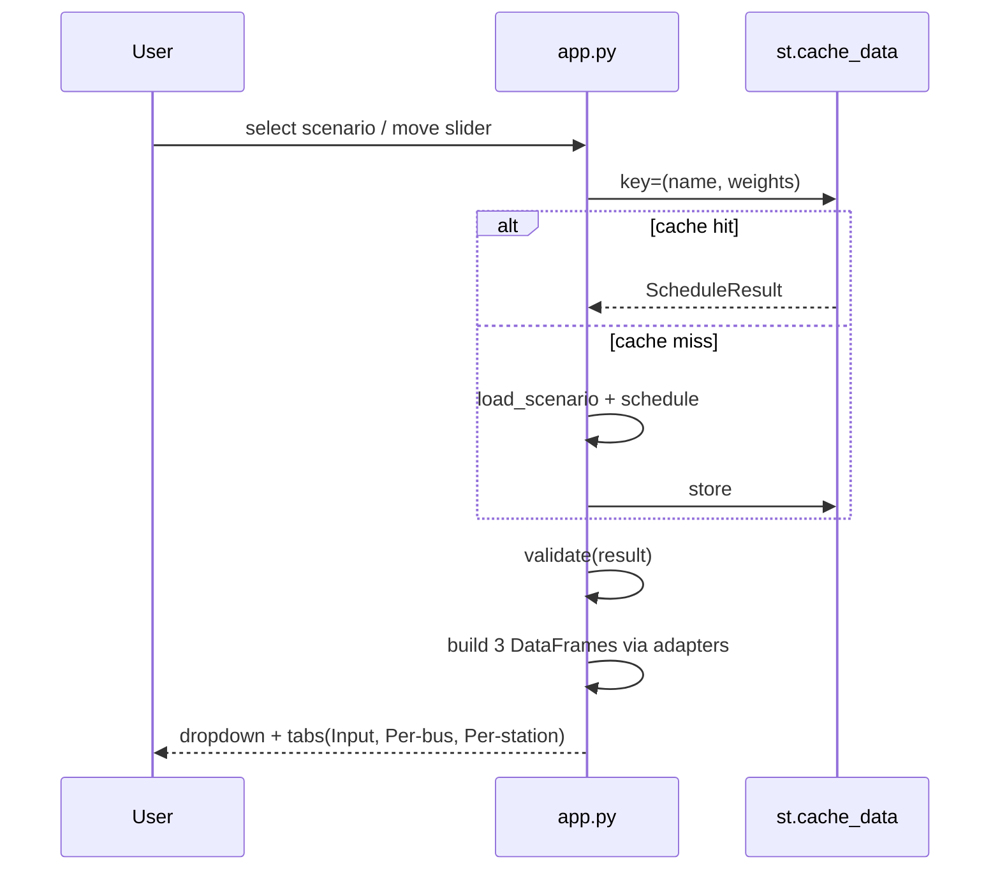

# Diagram — Render Sequence

```mermaid
sequenceDiagram
    participant U as User
    participant App as app.py
    participant Cache as st.cache_data
    U->>App: select scenario / move slider
    App->>Cache: key=(name, weights)
    alt cache hit
        Cache-->>App: ScheduleResult
    else cache miss
        App->>App: load_scenario + schedule
        App->>Cache: store
    end
    App->>App: validate(result)
    App->>App: build 3 DataFrames via adapters
    App-->>U: dropdown + tabs(Input, Per-bus, Per-station)
```
