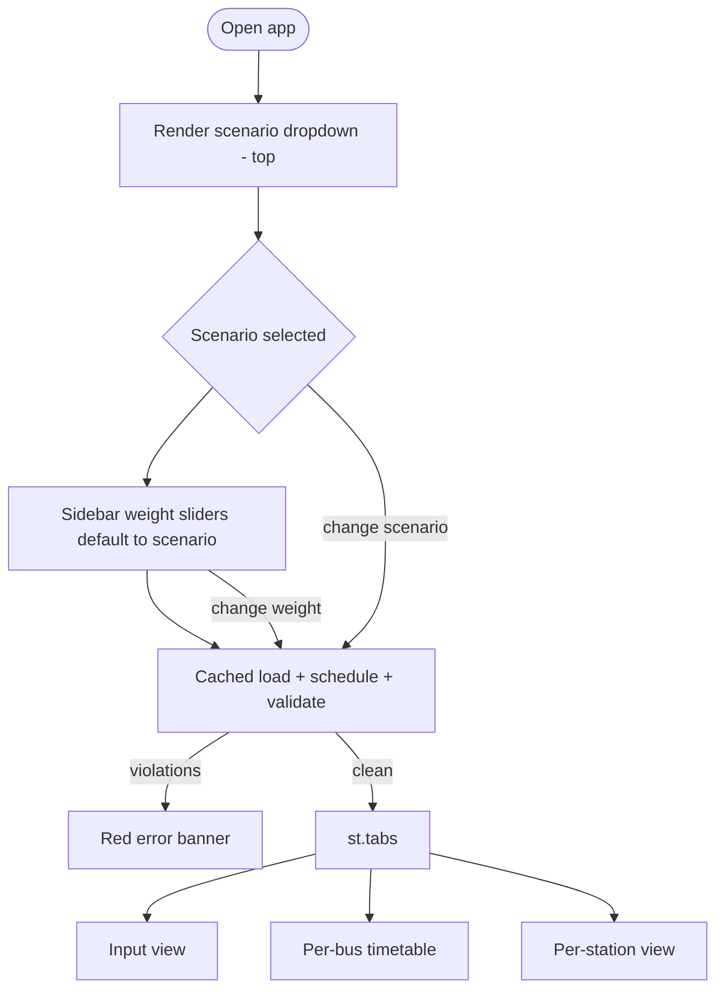

# Diagram — UI Navigation Flow

```mermaid
flowchart TD
    Open([Open app]) --> DD[Render scenario dropdown - top]
    DD --> Sel{Scenario selected}
    Sel --> WSliders[Sidebar weight sliders default to scenario]
    WSliders --> Run[Cached load + schedule + validate]
    Run -->|violations| Banner[Red error banner]
    Run -->|clean| Tabs[st.tabs]
    Tabs --> T1[Input view]
    Tabs --> T2[Per-bus timetable]
    Tabs --> T3[Per-station view]
    WSliders -->|change weight| Run
    Sel -->|change scenario| Run
```
