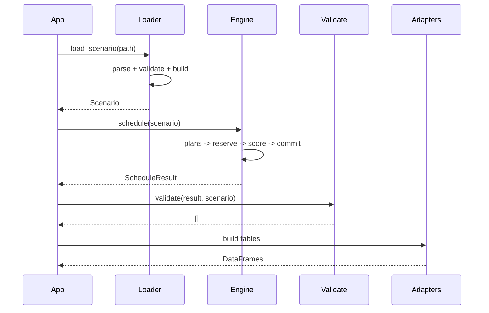

# Diagram — Backend Service Sequence

```mermaid
sequenceDiagram
    participant App
    participant Loader
    participant Engine
    participant Validate
    participant Adapters
    App->>Loader: load_scenario(path)
    Loader->>Loader: parse + validate + build
    Loader-->>App: Scenario
    App->>Engine: schedule(scenario)
    Engine->>Engine: plans -> reserve -> score -> commit
    Engine-->>App: ScheduleResult
    App->>Validate: validate(result, scenario)
    Validate-->>App: []
    App->>Adapters: build tables
    Adapters-->>App: DataFrames
```
