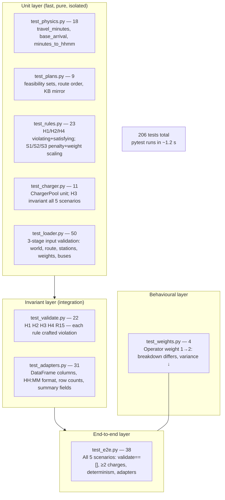

# Diagram — Test Pyramid

## Test count by file

| File | Tests | What it covers |
|------|-------|----------------|
| `test_physics.py` | 18 | Travel time arithmetic, `minutes_to_hhmm` edge cases |
| `test_plans.py` | 9 | BK/KB feasibility sets, route-order preservation, impossible range |
| `test_rules.py` | 23 | Every rule: violating + satisfying case, weight scaling, weight=0 silences |
| `test_charger.py` | 11 | Pool unit (serial/parallel), H3 across all 5 scenarios |
| `test_loader.py` | 50 | Full 3-stage validation — every `ValueError` branch in loader |
| `test_validate.py` | 22 | Post-schedule validator: H1/H2/H3/H4/R15 each triggered by crafted data |
| `test_adapters.py` | 31 | DataFrame adapters: columns, formats, row counts, per-bus summaries |
| `test_e2e.py` | 38 | All 5 scenarios × {validate, ≥2 charges, arrival, count, stations, objective, determinism} + adapter smoke |
| `test_weights.py` | 4 | Weight sensitivity: operator term changes, variance ↓ at higher operator weight |
| `conftest.py` | — | Shared fixtures (`build_scenario`, `make_event`) — no test methods |
| **Total** | **206** | **All requirements R1–R44 covered** |
