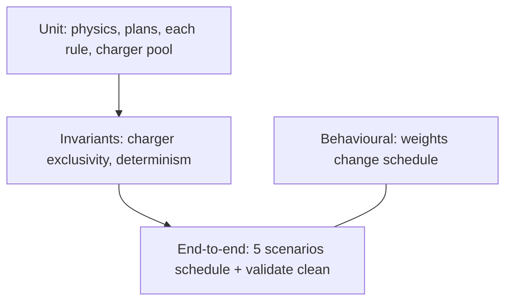

# Diagram — Test Pyramid

```mermaid
flowchart TD
    E2E[End-to-end: 5 scenarios schedule + validate clean]
    INV[Invariants: charger exclusivity, determinism]
    UNIT[Unit: physics, plans, each rule, charger pool]
    UNIT --> INV --> E2E
    BEH[Behavioural: weights change schedule] --- E2E
```
