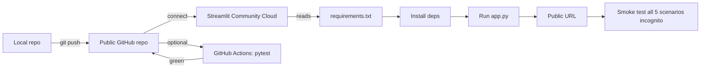

# Diagram — Deployment Flow

```mermaid
flowchart LR
    Dev[Local repo] -->|git push| GH[Public GitHub repo]
    GH -->|connect| SC[Streamlit Community Cloud]
    SC -->|reads| Req[requirements.txt]
    Req --> Build[Install deps]
    Build --> Boot[Run app.py]
    Boot --> URL[Public URL]
    GH -->|optional| CI[GitHub Actions: pytest]
    CI -->|green| GH
    URL --> Smoke[Smoke test all 5 scenarios incognito]
```
