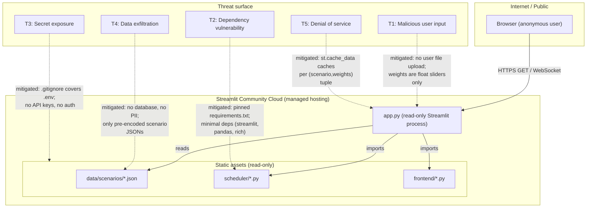

# Diagram — Security Threat Model

## Threat register

| ID | Threat | Status | Control |
|----|--------|--------|---------|
| T1 | Malicious user input | **Mitigated** | Weights are `st.slider` (float, min=0, max=5). No free-text input, no file upload. Scenario selection is a fixed dropdown from bundled files only. |
| T2 | Dependency vulnerability (CVE) | **Accepted (low risk)** | All three deps (streamlit, pandas, rich) are pinned in `requirements.txt`. No network calls inside engine. |
| T3 | Secret / credential exposure | **Mitigated** | `.gitignore` excludes `.env`, `secrets.toml`, `*.pem`. App requires zero API keys. |
| T4 | Data exfiltration | **N/A** | No user data is stored. Scenario files are static public JSON. No database, no auth, no PII. |
| T5 | DoS via expensive schedule runs | **Mitigated** | `@st.cache_data` on `_cached_schedule()` de-duplicates runs. Max 20 buses × 4 stations × ~4 plans each = bounded O(1) work. |

## If the threat surface grows

These controls would need revisiting if the app were extended to:

- Accept **user-uploaded JSON** → input sanitisation + size limit needed
- Expose a **REST API** → authentication + rate limiting needed
- Store **session data** → encryption at rest + GDPR review needed
- Move to **multi-tenant hosting** → process isolation needed
