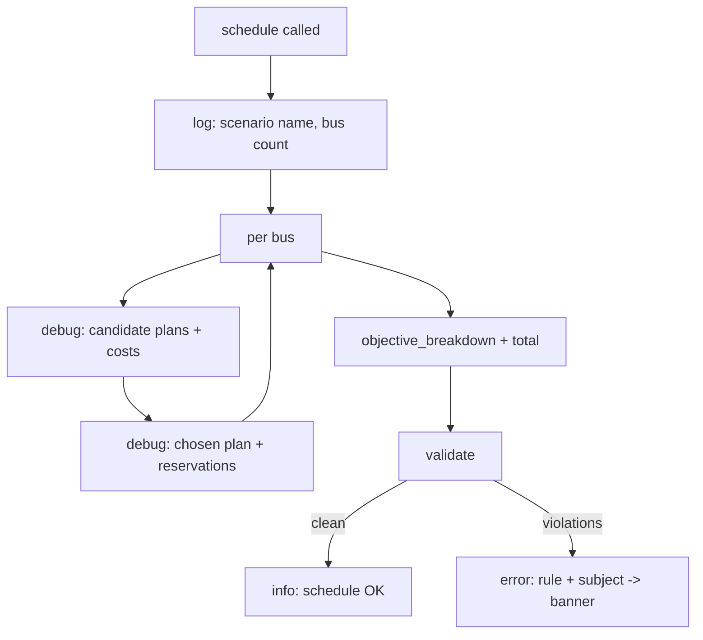

# Diagram — Logging & Decision Trace Flow

```mermaid
flowchart TD
    S[schedule called] --> L1[log: scenario name, bus count]
    L1 --> Loop[per bus]
    Loop --> L2[debug: candidate plans + costs]
    L2 --> L3[debug: chosen plan + reservations]
    L3 --> Loop
    Loop --> BD[objective_breakdown + total]
    BD --> V[validate]
    V -->|clean| L4[info: schedule OK]
    V -->|violations| L5[error: rule + subject -> banner]
```
